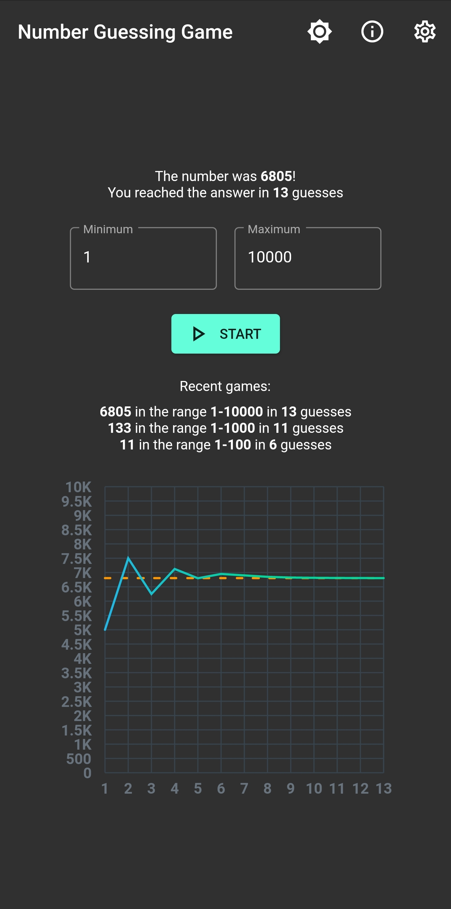
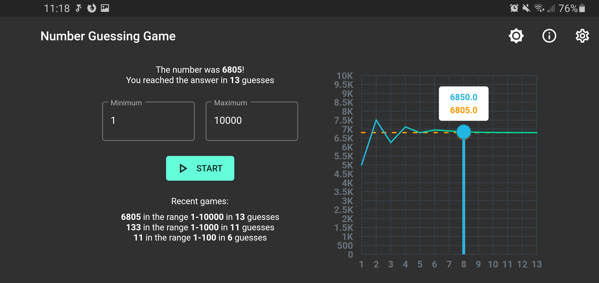
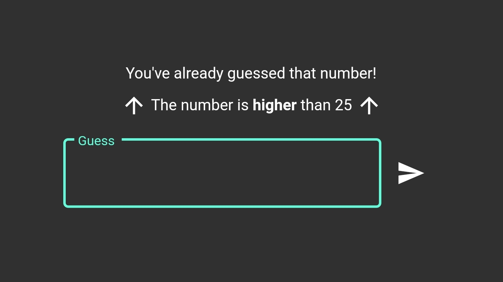
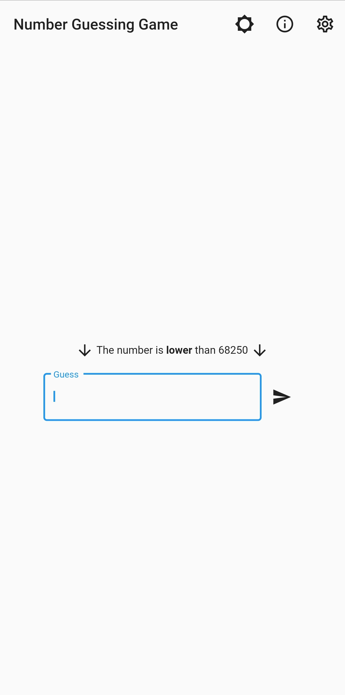

# Number Guessing Game

### Coding Club challenge #2 entry

A Flutter app for the number guessing game.

Complete with theming, recent games, line charts, and good design.

### What even is Flutter?

Flutter is a cross-platform framework for Android, iOS, Desktop, and the Web. It uses the Dart programming language, which is similar to Java/Javascript.

Learn more at <https://flutter.dev>.

### Running

Prereqs:

- Flutter SDK (>2.11)
- Android SDK
- A macOS device if you are testing on an iOS device
  - Xcode stuff too
- Some editor
  - Flutter and Dart extensions if available

`flutter doctor` should print no errors.

1. Clone this repo.
2. Install dependencies either through your editor or with `flutter pub get`
3. Start in debug mode with `flutter run` or through your editor

There are some prebuilt versions in the releases as well.
